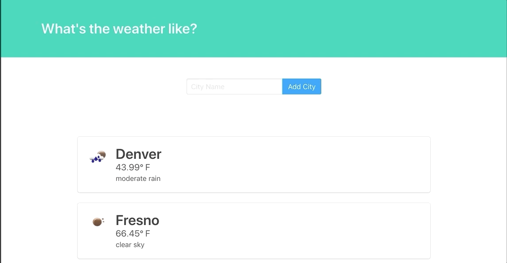

# Django Weather App

Weather App built with Python and Django.

Utilizing the OpenWeatherMap API, users are able to search cities and retreive weather information in real time.

Users retreive temperature and weather description once call is made:

Testing PR Action
---
Randy Galeano | 2019
